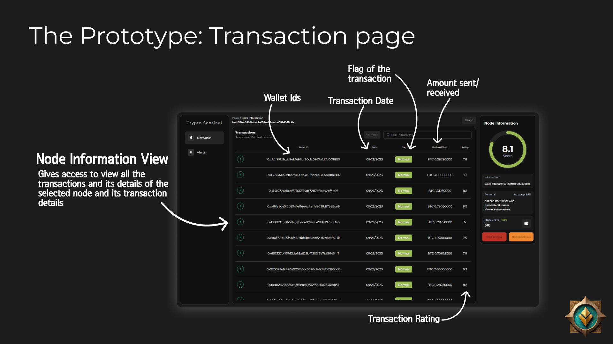

# Team Anokha

We are Team Anokha, and for our problem statement, we chose "De-anonymisation for monitoring and tracking of illegal
activities performed using cryptocurrency transaction
technology". 

### What is our application about? 

Transactions can be tracked with the help of blockchain data and government-controlled sources, and we pass the data stream for preprocessing for our model prediction. Based on the transactions made by each individual wallet, the "BERT4Crypto" Neural Network rates each wallet and tags the wallet for suspicious activity if the rating is too low. It also monitors transactions in real time for this use case. 
  

1. <b>Blockchain Monitoring</b>: Establish a monitoring and tracking layer to collect real-time data from popular blockchain platforms like Bitcoin, Ethereum, and Polygon. This data includes transactions, wallet addresses, and other relevant information.

2. <b>Visual Network Representation</b>: Develop a visual network representation of blockchain nodes (wallets), displaying transactions and connections between wallets. This visualization provides a clear overview of the blockchain network and facilitates analysis of wallet interactions.

3. <b>Data Ingestion and Enrichment</b>: Ingest data from multiple official sources, such as cryptocurrency exchanges, criminal records, and other relevant databases. This data is used to tag KYC (Know Your Customer) information, personal identification details, and other relevant metadata onto wallet addresses.

4. <b>Deep Learning Models</b>: Implement deep learning models to analyze the blockchain network and score individual nodes (wallets). These models can accurately predict connected wallets based on transaction patterns, network connections, and other relevant features.

5. <b>Generative AI for Data Analysis</b>: Utilize generative AI models to analyze unstructured data associated with blockchain transactions and wallets. These models can summarize the data, extract patterns, and identify trends, assisting officials in drafting reports and making informed decisions.

### We used the following tech stack: 
1. MongoDB, 
2. Electron + React
3. Node.js Backend (Express) 
4. Python (for web-scraping)
5. Keras/Tensorflow (NLP)
  

### Photos:

This project is a small-scale implementation of the paper "Deanonymisation of clients in Bitcoin P2P network": [View paper](https://arxiv.org/abs/1405.7418)

### HackFest '24 - CSI
Members: Jones, Dhyaneesh, Kaviraj and Akshath
